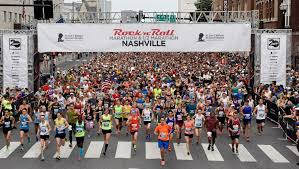

# web-scraping-marathon_data

The data for the Nashville Rock-and-Roll Marathon that you worked with in Excel was scraped from the `www.runrocknroll.com` race results page. 
Now it's your turn to scrape the data from the website! 
We have included the base URLs that you will be using to scrape the RunRocknRoll website.

## RunRockNRoll URLs

```python
urls = [
    "https://www.runrocknroll.com/Events/Nashville/The-Races/Marathon/2019-Results/gender=&agegroup=&bib=&firstname=&lastname=&page={page_number}",
    "https://www.runrocknroll.com/Events/Nashville/The-Races/Marathon/2018-Results/gender=&agegroup=&bib=&firstname=&lastname=&page={page_number}",
    "https://www.runrocknroll.com/Events/Nashville/The-Races/Marathon/2017-Results/gender=&agegroup=&bib=&firstname=&lastname=&page={page_number}",
    "https://www.runrocknroll.com/Events/Nashville/The-Races/Marathon/2016-Results/gender=&agegroup=&bib=&firstname=&lastname=&page={page_number}",
    "https://www.runrocknroll.com/Events/Nashville/The-Races/Half-Marathon/2019-Results/gender=&agegroup=&bib=&firstname=&lastname=&page={page_number}",
    "https://www.runrocknroll.com/Events/Nashville/The-Races/Half-Marathon/2019-Results/gender=&agegroup=&bib=&firstname=&lastname=&page={page_number}",
    "https://www.runrocknroll.com/Events/Nashville/The-Races/Half-Marathon/2019-Results/gender=&agegroup=&bib=&firstname=&lastname=&page={page_number}",
    "https://www.runrocknroll.com/Events/Nashville/The-Races/Half-Marathon/2019-Results/gender=&agegroup=&bib=&firstname=&lastname=&page={page_number}",
]
```

With all of these URLs, note the `{page_number}` part. 
In python, this is an opportunity to use string interpolation.
This means that it is expecting a variable to be used as the `{page_number}`.
Here is an example:

```python
urls[0].format(page_number=1)
```
Outputs:
```
https://www.runrocknroll.com/Events/Nashville/The-Races/Marathon/2019-Results/gender=&agegroup=&bib=&firstname=&lastname=&page=1
```

Notice how the `{page_number}` is gone now.
Use these to make requests to the website to fetch your HTML!

### Reference
Use the different level notebooks we walked through in class as a reference on how to approach this. 

Additionally.. 
The RunRockNRoll website _submits a form_ to request data to populate the website. 
In order to fetch the data yourself.. 
What kind of REST action might you use to  with this?

## Next Steps

After loading the marathon and half-marathon data to DataFrames in Python, perform EDA as usual. 
Think of a question that you find interesting and answer it with the data. 
Prepare a brief (5 minutes) presentation to share what you find.


